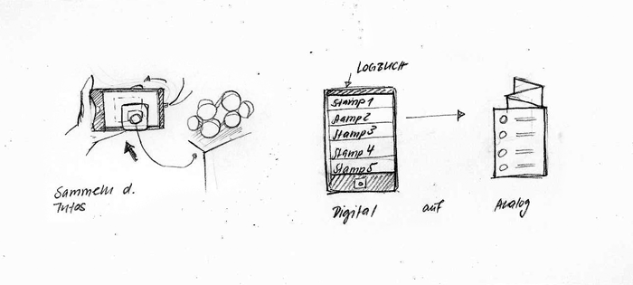
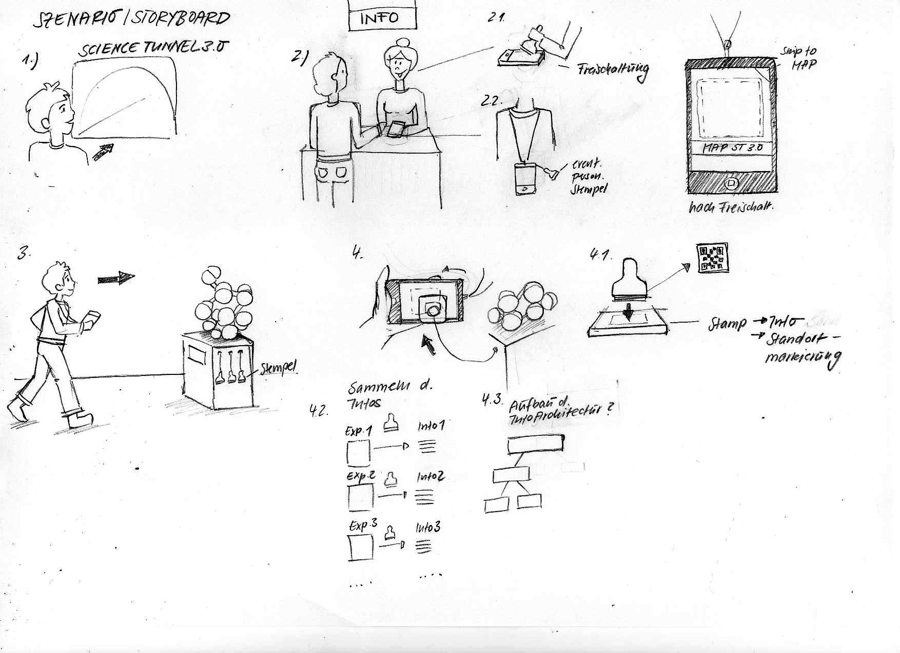
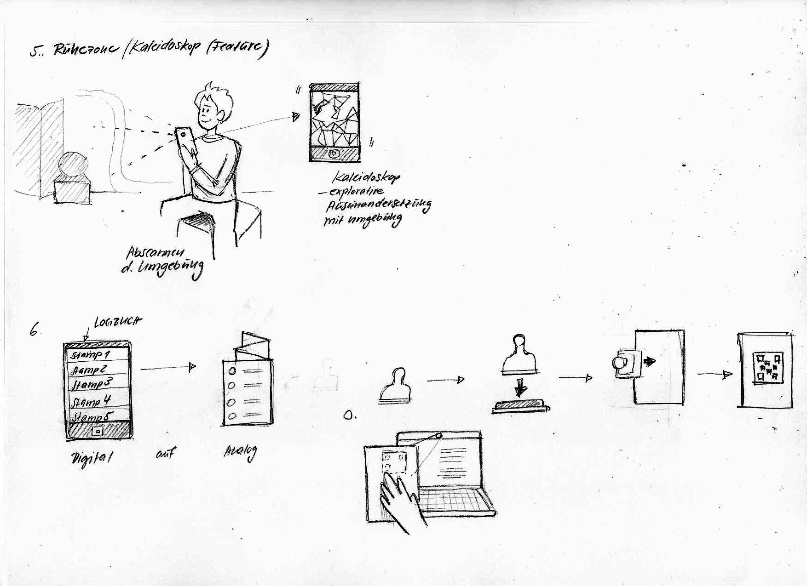
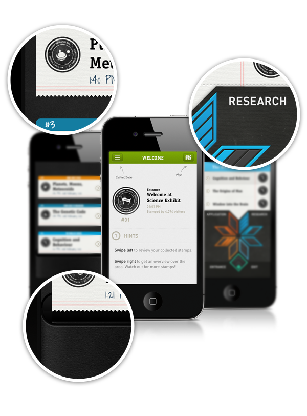
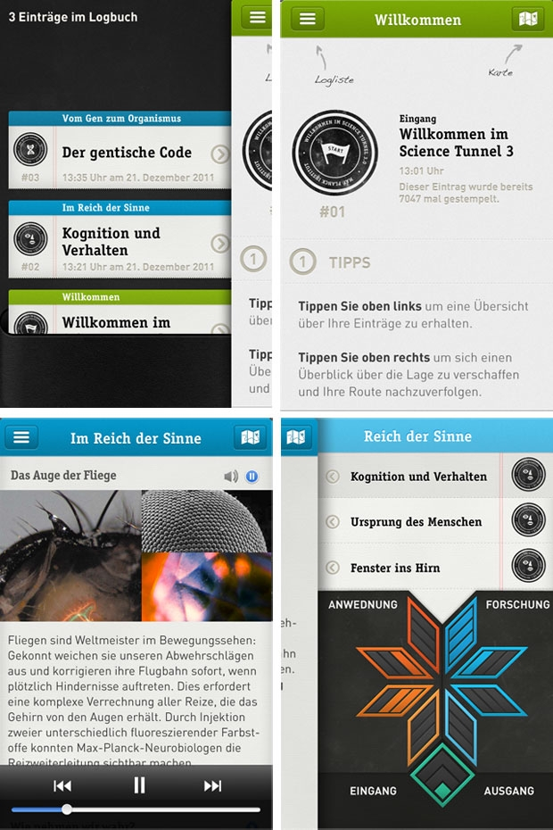
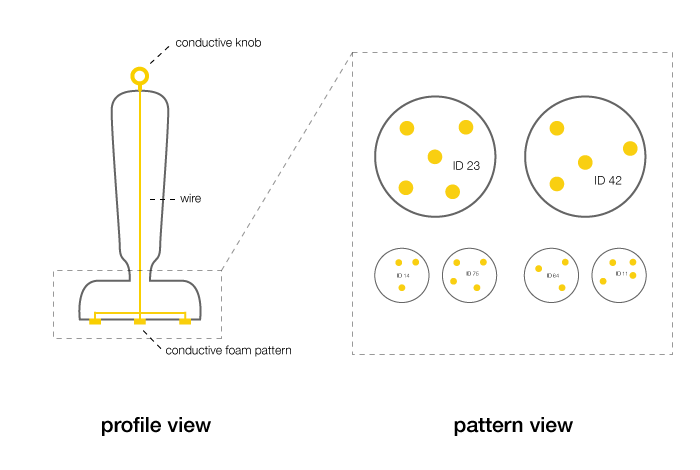
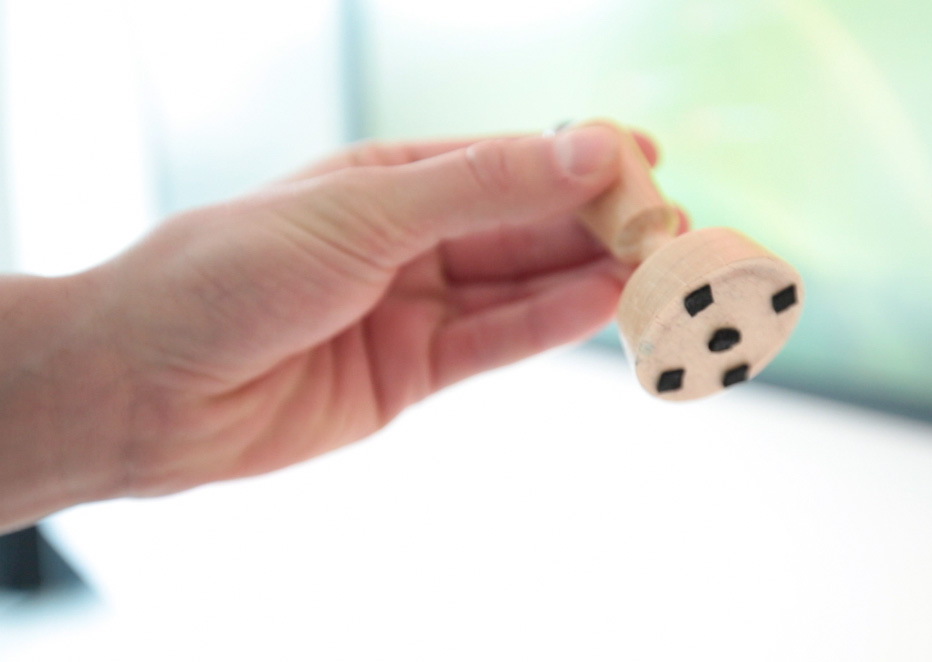
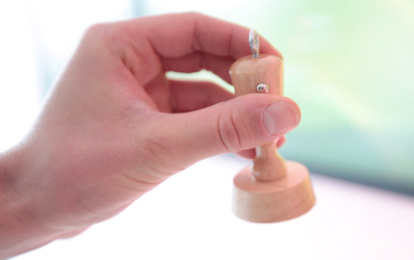

# Logbook

How Physical Interfaces Can Push Exhibition Apps to the Next Level

We have been featured on design.org with an [extensive interview](http://design.org/blog/logbook-digital-stampbook-app-recording-experiences).

https://vimeo.com/36371083

The Problem of Exhibition Apps
------------------------------

Almost every big museum or exhibition offers apps for three reasons: content, navigation and participation.

 Most of them do a good job in providing additional media such as articles, images, videos and integrating maps of the exhibition space. Moreover, nearly all of them replace former audio guides by copying the well-known procedure of entering 3 or 4 digit numbers to access the information. But at times we tend to get a little bit frustrated when we fail to enter our smartphone pin correctly; we thought that there must a better way to connect an app with an exhibit: What about a well known physical interaction ?

  The Concept
-----------

As part of our class, "Connect to Science," at the University of Applied Sciences, Potsdam, we've developed a concept for a digital logbook that keeps track of everything that visitors find interesting while exploring an exhibition space.

 In contrast to other solutions, it doesn’t try to overwhelm users with a catalogue of everything of what’s inside. Instead the app offers nothing but an empty logbook that can be filled with stamps — like a passport, keeping track of everywhere you have traveled. We believe that revisiting an experience is as important as the actual hours on location. The logbook does just this — helping to memorize each moment so you can relive it on another day.

    [‹](#storyCarousel) [›](#storyCarousel)  Design
------

Considering the the broad spectrum of users, from kids to seniors, we felt the need for a flat information architecture and came up with three views: Collection, Review and Map.

 With successful apps such as Path and Facebook, we were inspired by their navigation and re-interpreted it to fit our needs. Users can swipe left and right to switch between the different sections of the Logbook. To collect something new, you simply orient the device to landscape mode and stamp on the blank canvas. Your Logbook will then be packed with articles, photos and videos waiting to be reviewed instantly while you are on the go or relaxing comfortably at home. Users can swipe left and right to switch between the different sections of the Logbook. To collect something new, you simply orient the device to landscape mode and stamp on the blank canvas. Your Logbook will then be packed with articles, photos and videos waiting to be reviewed instantly or when you are at home.

    [‹](#designCarousel) [›](#designCarousel)  Prototype
---------

Our prototype setup consists of a wooden stamp that can be recognized by our web app that runs on an iPhone.

 On the hardware-side, we drilled a hole through the stamp, attached three soft conductive pads to the bottom and connected them to a copper wire that ends at the top of the stamp. As the stamp touches the screen of the iPhone, it recognizes a pattern of touch points that relates to the specific stamp. As we can vary the distance, as well as the number of touch points —up to 5 possibilities — the assortment stamps are endless. On the software side, we prototyped parts of the app with Javascript while making heavy use of CSS3 transitions. Having both, stamp and app, we were able to turn our design into a prototype to demonstrate our concept in our video.

    [‹](#protoCarousel) [›](#protoCarousel) [show me more](#)

 Process
-------

From brainstorming to content concepts to wireframes to design and real prototypes

© Christopher Pietsch, Florian Schulz and Wenke Kramp
